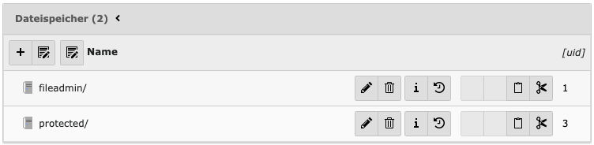
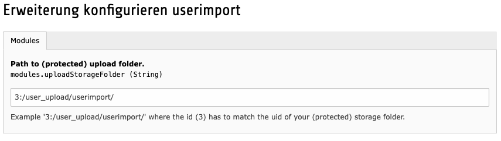

# ext-userimport

Make sure to upload your files containing user data to a secure folder!

### Setup a protected storage folder

1. Create a folder /protected/user_upload/userimport in your webroot.
2. Create a protected "File Storage" record and set "protected/" as base path and disallow public access.
3. Create a "Filemount" record for the folder protected/user_upload/userimport.
4. Add the Filemount to a "Backend Usergroup" to allow access for non admin users.

### Add your storage folder to the module configuration

Module configuration in this Extension Manager.

Make sure to match the id to your previously created storage folder.

Example entry: `<uid-of-your-protected-storage>:/<subfolder>/`

